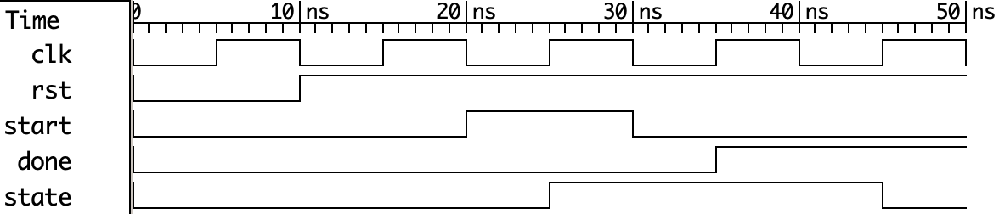

# matmul_unit design specification

## Overview
### module name matmul_unit
matmul_unit
### module purpose
This module implements a synchronous matrix multiplication unit that computes $C=A \times B$,where A,B,and C are size $\times$ size matrices.
## Parameters
## Interface signals
## Function description
## Time diagram

## Test plan